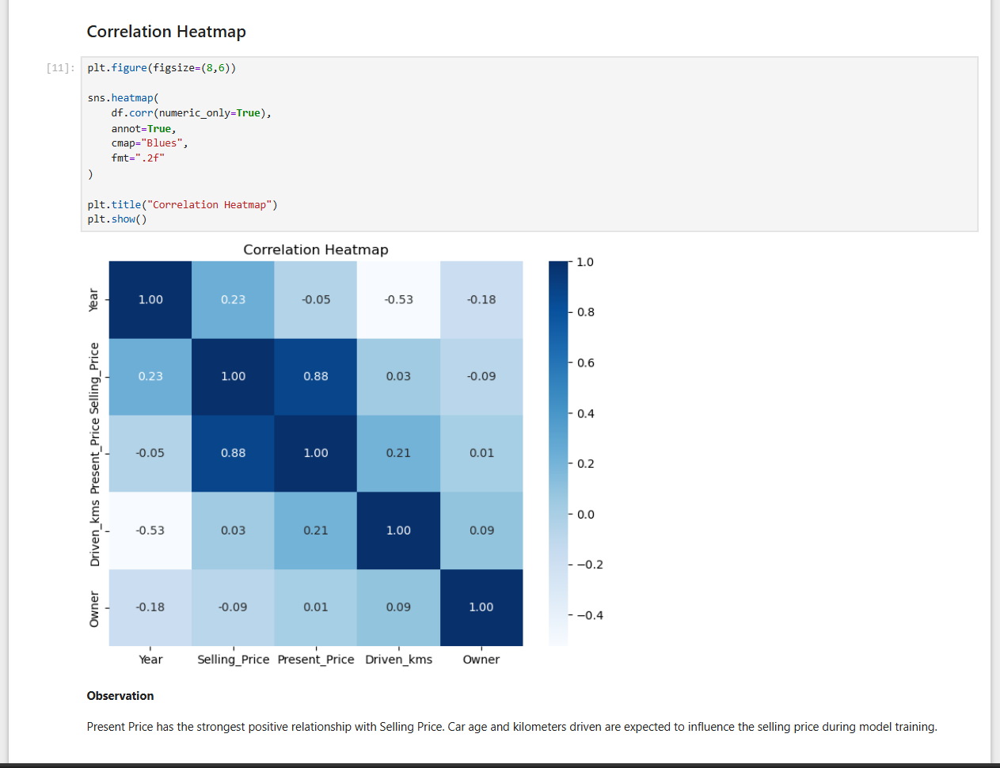
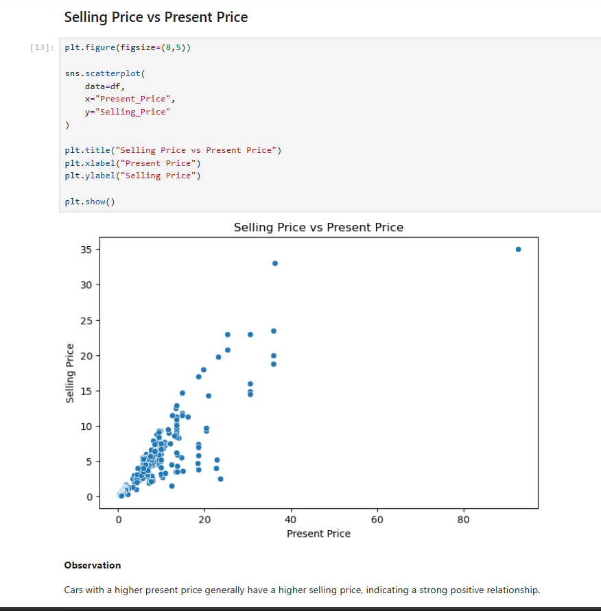
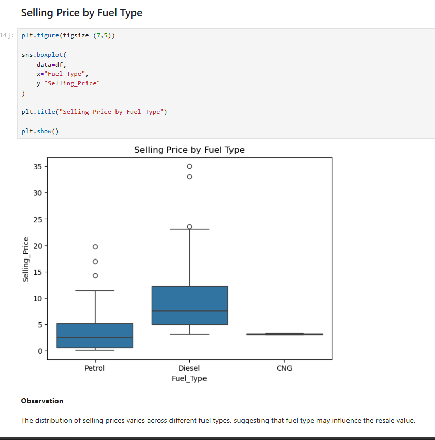

# Car Price Prediction using Machine Learning

## Overview

This project builds a **Machine Learning regression model** to predict the selling price of used cars based on features such as present price, manufacturing year, fuel type, transmission, seller type, kilometers driven, and ownership.

The project follows a complete machine learning workflow including data preprocessing, exploratory data analysis, feature engineering, model training, and performance evaluation using Linear Regression.

---

## Technologies Used

* Python
* Pandas
* NumPy
* Matplotlib
* Seaborn
* Scikit-learn
* Jupyter Notebook

---

## Dataset

The dataset contains historical information about used cars with the following attributes:

* Car Name
* Year
* Present Price
* Selling Price
* Kilometers Driven
* Fuel Type
* Seller Type
* Transmission
* Owner

These features are used to train a regression model capable of estimating the selling price of a vehicle.

---

## Machine Learning Workflow

* Data Collection
* Data Cleaning
* Exploratory Data Analysis (EDA)
* Feature Engineering
* Categorical Feature Encoding
* Train-Test Split
* Linear Regression Model Training
* Model Evaluation

---

## Exploratory Data Analysis

### Correlation Heatmap

The heatmap shows the correlation between numerical features. It helps identify the variables that contribute most to predicting the selling price.

<p align="center">
  
</p>

---

### Selling Price vs Present Price

This visualization demonstrates a strong positive relationship between the present market value of a car and its selling price, making it one of the most influential features in the prediction model.

<p align="center">
  
</p>

---

### Selling Price by Fuel Type

The chart compares selling prices across different fuel types and provides insight into how fuel category affects resale value.

<p align="center">
  
</p>

---

## Results

The Linear Regression model was trained after preprocessing and feature engineering.

**Evaluation Metrics**

* Training Score: **0.90**
* Testing Score: **0.75**

---

## Key Observations

* Present Price is the strongest predictor of Selling Price.
* Older vehicles generally have lower resale values.
* Fuel Type has a noticeable impact on the selling price.
* Feature engineering and preprocessing improve model performance.
* Linear Regression provides a strong baseline for used car price prediction.

---

## Project Structure

```text
Car-Price-Prediction/
│
├── images/
│   ├── correlation_heatmap.png
│   ├── cars_by_fuel_type.png
|   ├── numerical_feature_distribution.png
|   ├── pair_plot.png
|   ├── selling_price_vs_present_price.png
│   └── selling_price_by_fuel_type.png
│
├── car data.csv
├── main.ipynb
├── requirements.txt
└── README.md
```

---

## Installation

Clone the repository:

```bash
git clone https://github.com/Anshuman-Singh-Parihar/codealpha_tasks.git
```

Move to the project directory:

```bash
cd Car-Price-Prediction
```

Install the required dependencies:

```bash
pip install -r requirements.txt
```

Launch Jupyter Notebook:

```bash
jupyter notebook
```

---

## Conclusion

This project demonstrates a complete machine learning pipeline for predicting used car prices using Linear Regression. It applies data preprocessing, exploratory data analysis, feature engineering, and model evaluation to build a reliable regression model. The project provides practical experience in solving a real-world price prediction problem using Python and Scikit-learn.
