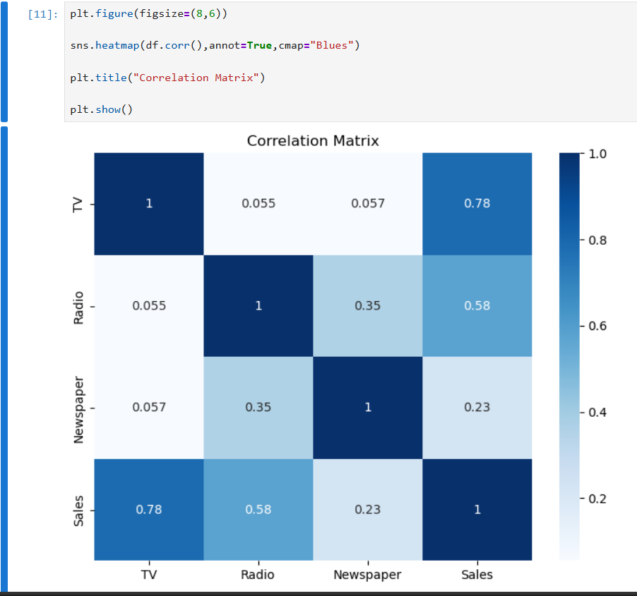
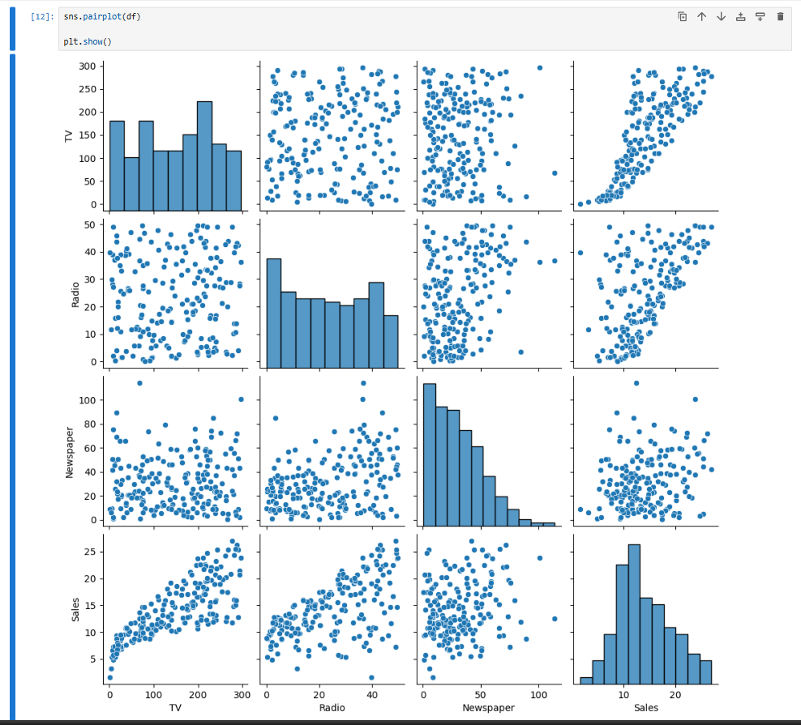
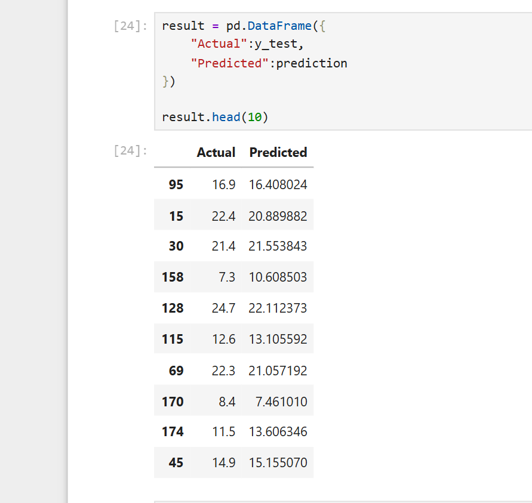

# Sales Prediction using Python

## Overview

This project focuses on predicting product sales using a Linear Regression model. The analysis is performed on the Advertising dataset, where advertising budgets for TV, Radio, and Newspaper are used to estimate product sales.

The notebook follows a complete machine learning workflow, including data exploration, preprocessing, visualization, model training, evaluation, and prediction.

---

## Dataset

The project uses the **Advertising** dataset with the following features:

* TV Advertising Budget
* Radio Advertising Budget
* Newspaper Advertising Budget
* Sales (Target Variable)

---

## Project Workflow

The notebook includes the following steps:

* Importing the required libraries
* Loading the dataset
* Exploring the dataset
* Data cleaning
* Exploratory Data Analysis (EDA)
* Correlation analysis
* Feature engineering by creating a `Total_Ads` feature
* Splitting the dataset into training and testing sets
* Training a Linear Regression model
* Evaluating the model using standard regression metrics
* Predicting sales for a new advertising budget

---

## Technologies Used

* Python
* Jupyter Notebook
* Pandas
* NumPy
* Matplotlib
* Seaborn
* Scikit-learn

---

## Model Evaluation

The model performance is evaluated using:

* Mean Absolute Error (MAE)
* Mean Squared Error (MSE)
* Root Mean Squared Error (RMSE)
* R² Score

---

## Visualizations

The notebook includes the following visualizations:

* Correlation Heatmap
* Pair Plot
* Histograms
* Scatter Plots
* Actual vs Predicted Sales

---

## Project Structure

```text
sales-prediction-using-linear-regression/
│
├── Sales_Prediction.ipynb
├── Advertising.csv
├── README.md
├── requirements.txt
├── LICENSE
│
└── images/
    ├── correlation_heatmap.png
    ├── pairplot.png
    └── actual_vs_predicted.png
```

---

## Project Images

### Correlation Heatmap



### Pair Plot



### Actual vs Predicted Sales



---

## Installation

Clone the repository:

```bash
git clone https://github.com/Anshuman-Singh-Parihar/codealpha_tasks.git
```

Install the required libraries:

```bash
pip install -r requirements.txt
```

Open the notebook and run all cells in order.

---

## Author

Anshuman Singh

BCA Student with Data Analytics skill and Machine Learner.
