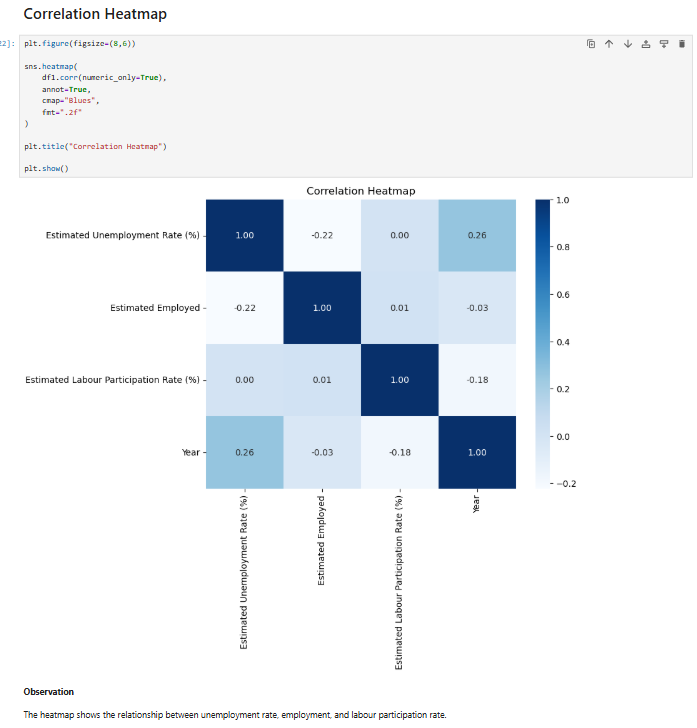
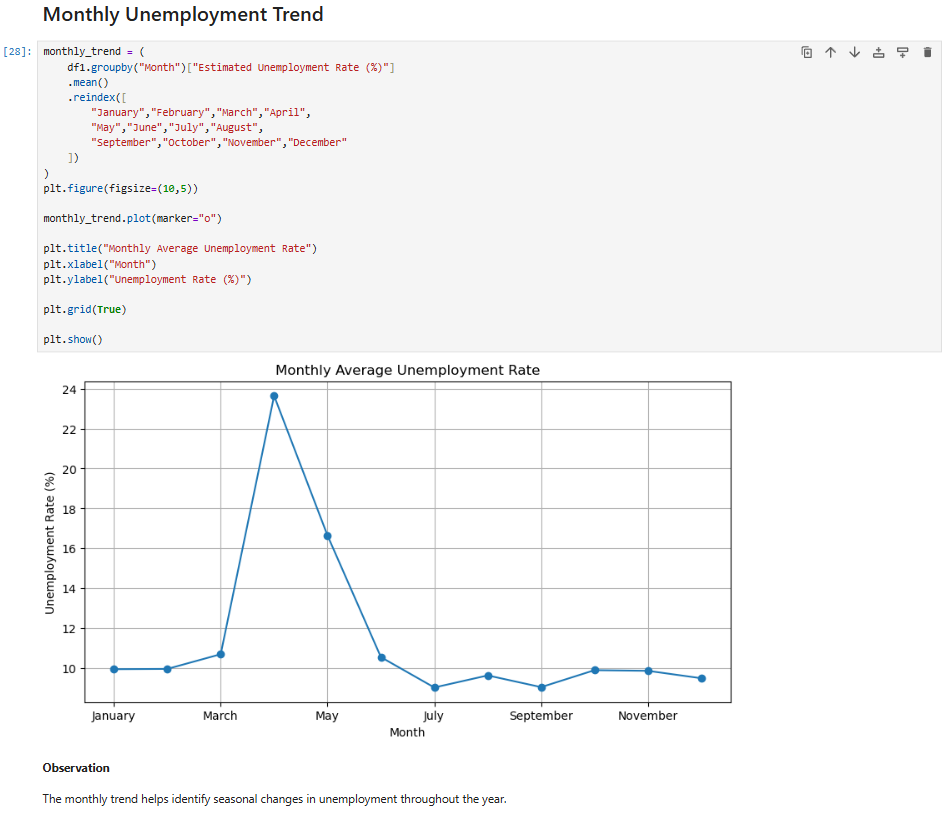
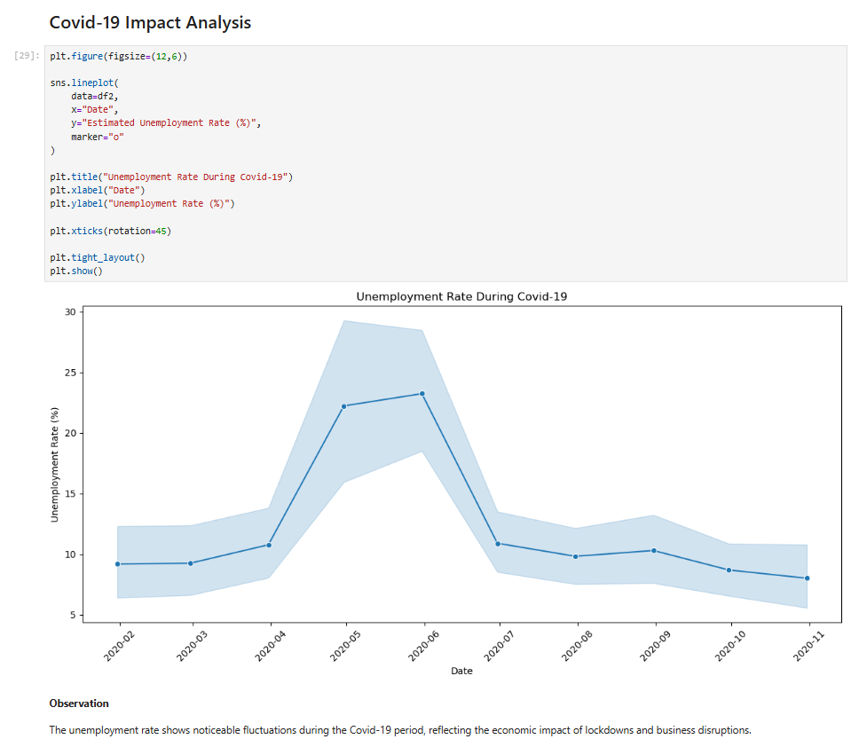
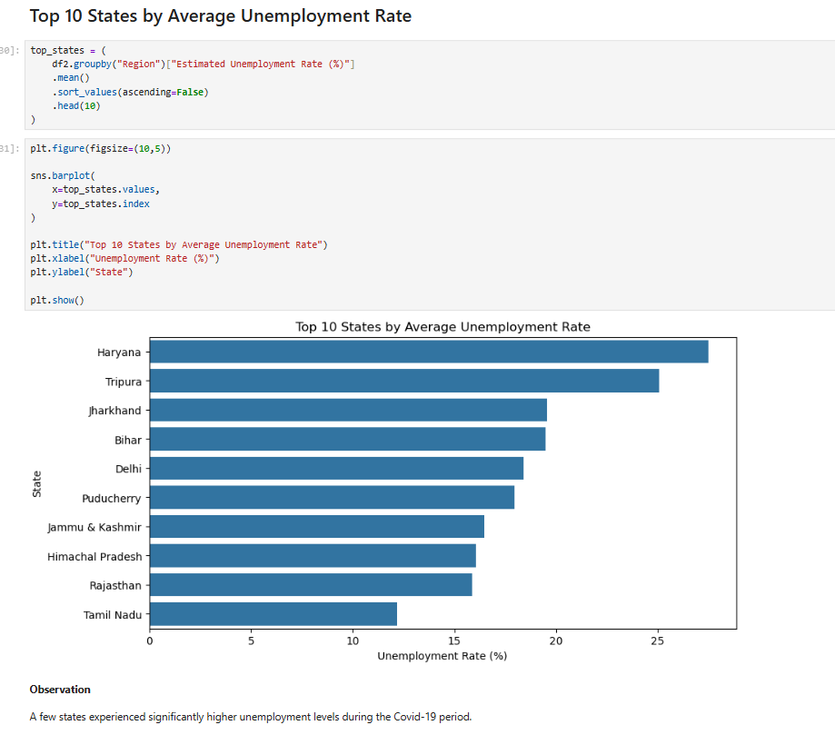

# Unemployment Analysis with Python

## Overview

This project analyzes unemployment trends in India using two datasets. The objective is to understand unemployment patterns across different states and regions, examine the impact of Covid-19 on employment, and identify trends through data visualization. The project focuses on data cleaning, exploratory data analysis (EDA), and generating insights that can support economic and policy-related decisions.

---

## Objectives

* Clean and prepare unemployment datasets for analysis.
* Explore unemployment trends across states and regions.
* Analyze monthly unemployment patterns.
* Investigate the impact of Covid-19 on unemployment rates.
* Compare labour participation and employment trends.
* Present insights that can support economic and social policy decisions.

---

## Dataset

The project uses two datasets:

* **Unemployment in India.csv**
* **Unemployment_Rate_upto_11_2020.csv**

These datasets include information such as:

* Region
* Date
* Area (Urban/Rural)
* Estimated Unemployment Rate (%)
* Estimated Employed
* Estimated Labour Participation Rate (%)
* Geographic information (Latitude and Longitude)

---

## Technologies Used

* Python
* Pandas
* NumPy
* Matplotlib
* Seaborn
* Jupyter Notebook

---

## Project Workflow

1. Import required libraries.
2. Load both datasets.
3. Clean and prepare the data.
4. Perform exploratory data analysis.
5. Analyze unemployment trends across states and regions.
6. Study the impact of Covid-19.
7. Generate insights and conclusions.

---

## Visualizations

The project includes several visualizations, including:

* Distribution of unemployment rate
* Correlation heatmap
* State-wise unemployment analysis
* Monthly unemployment trend
* Covid-19 unemployment trend
* Top 10 states by unemployment rate
* Urban vs Rural unemployment comparison
* Labour participation trend
* Employment trend

---

## Results

The analysis highlights several important observations:

* Unemployment rates vary significantly across different states.
* Covid-19 caused noticeable fluctuations in unemployment and employment levels.
* Labour participation also changed during the pandemic.
* Some regions experienced a greater impact than others.
* Monthly trends indicate seasonal variations in unemployment.

---

## Project Structure

```text
unemployment-analysis-python/
│
├── Unemployment_Analysis.ipynb
├── Unemployment in India.csv
├── Unemployment_Rate_upto_11_2020.csv
├── README.md
├── requirements.txt
├── LICENSE
│
└── images/
    ├── correlation_heatmap.png
    ├── monthly_unemployment_trend.png
    ├── covid_impact.png
    └── top_10_states.png
```

---

## Screenshots

### Correlation Heatmap



---

### Monthly Unemployment Trend



---

### Covid-19 Impact on Unemployment



---

### Top 10 States by Average Unemployment Rate



---

## Installation

Clone the repository:

```bash
git clone <https://github.com/Anshuman-Singh-Parihar/codealpha_tasks>
```

Move to the project directory:

```bash
cd unemployment-analysis-with-python
```

Install the required libraries:

```bash
pip install -r requirements.txt
```

Launch Jupyter Notebook and open:

```
main.ipynb
```

---

## Conclusion

This project demonstrates how Python can be used to clean, analyze, and visualize unemployment data. By exploring regional patterns, monthly trends, and the effects of Covid-19, the analysis provides meaningful insights into employment conditions and highlights factors that may support informed economic planning.
